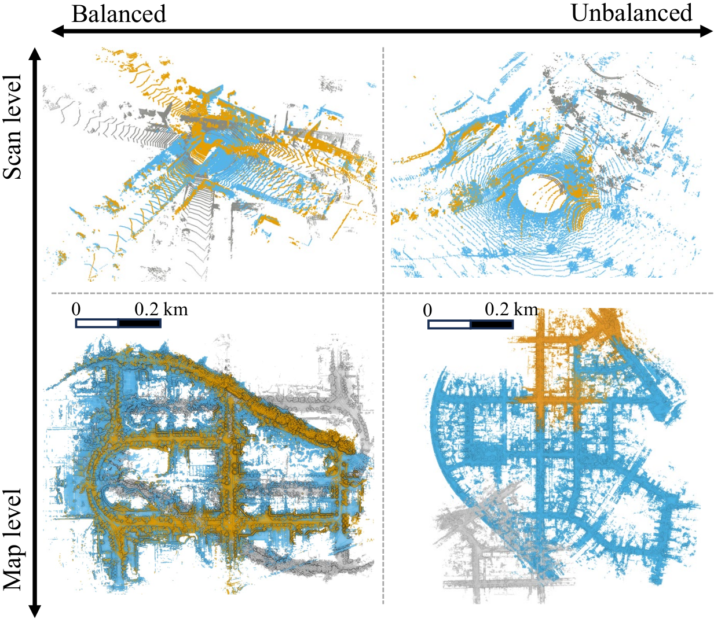

    <h1>KISS-Matcher</h1>
    
    
    
    
    
     
     
   
   
  

  
<strong><em>Keep it simple, make it scalable.</em></strong>

---

### 🚀 Stay tuned! Code will be released after acceptance.

